# EvalVerse User Guide

> 📖 [中文使用指南](USAGE_zh.md)

This guide will help you get started with EvalVerse and learn how to use all its features.

---

## Table of Contents

- [Dataset Management](#dataset-management)
- [Evaluator Management](#evaluator-management)
- [Model Configuration](#model-configuration)
- [Model Set Management](#model-set-management)
- [Experiment Management](#experiment-management)

---

## Dataset Management

### Creating a Dataset

1. Navigate to **Datasets** from the sidebar menu
2. Click the **Create Dataset** button
3. Fill in the dataset information:
   - **Name**: Enter a unique dataset name
   - **Description**: (Optional) Add a description
   - **Fields**: Configure dataset fields
4. Click **Create**

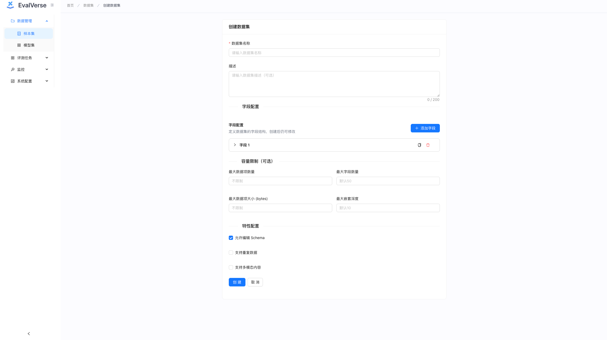

### Importing Data

1. Open the dataset detail page
2. Click **Import** button
3. Select your data file (CSV, JSON, or Excel format)
4. Configure import settings:
   - Field mappings
   - Import options
5. Click **Start Import** and wait for completion

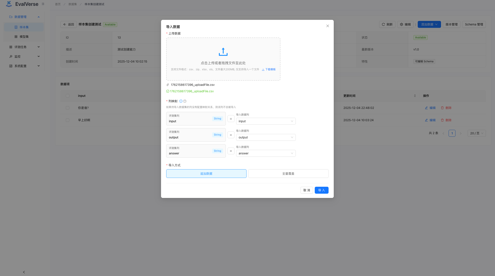

### Managing Dataset Versions

1. In the dataset detail page, go to the **Versions** tab
2. View all versions of the dataset
3. Create a new version by clicking **Create Version**
4. Compare different versions side by side

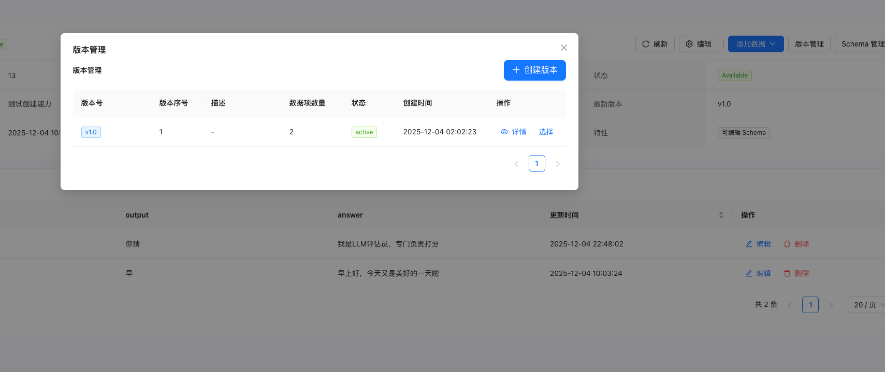

### Viewing and Editing Dataset Items

1. In the dataset detail page, go to the **Items** tab
2. Browse through dataset items
3. Click on an item to view details
4. Use **Edit** to modify item content
5. Use **Add Item** to manually add new items

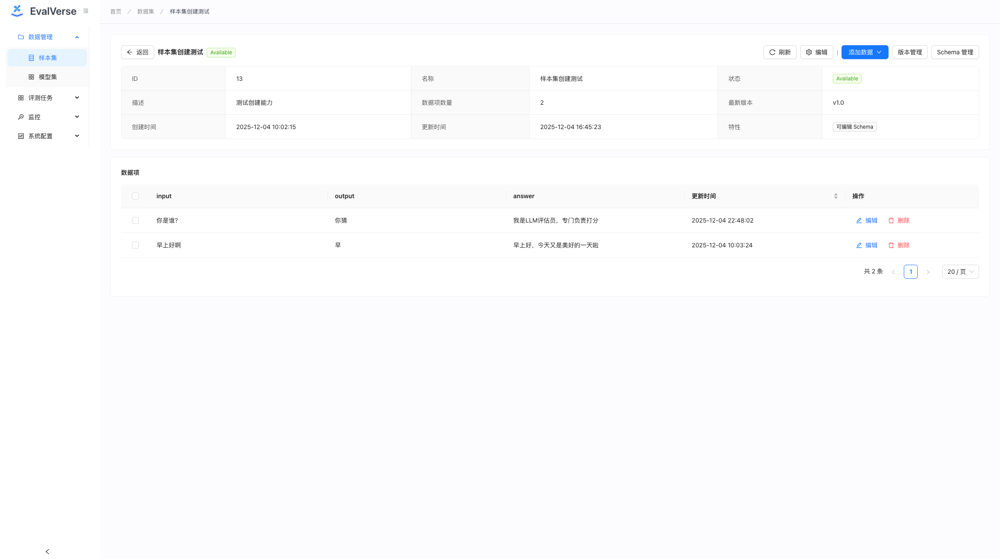

---

## Evaluator Management

### Creating a Code Evaluator

1. Navigate to **Evaluators** from the sidebar
2. Click **Create Evaluator** → Select **Code Evaluator**
3. Fill in the evaluator information:
   - **Name**: Enter evaluator name
   - **Description**: Add description
4. Write your evaluation code in the code editor:
   ```python
   def evaluate(input_data, actual_output):
       # Your evaluation logic here
       score = calculate_score(actual_output)
       reason = "Evaluation result"
       return score, reason
   ```
5. Configure input/output schemas
6. Click **Submit** to create the evaluator

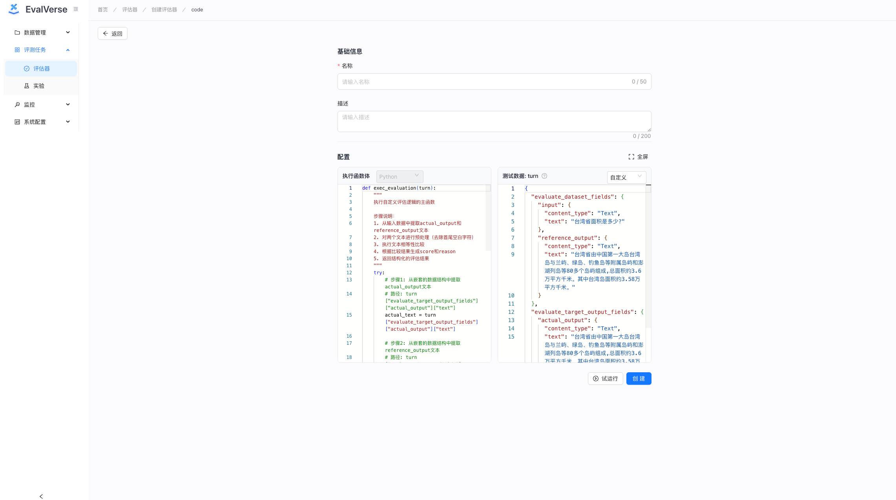

### Creating a prompt evaluator

1. Navigate to **Evaluators** → **Create Evaluator** → Select **prompt evaluator**
2. Fill in basic information
3. Configure the prompt template:
   - Define the evaluation prompt
   - Set up input/output schemas
   - Configure model settings
4. Test the evaluator using the debug panel
5. Click **Submit** to create

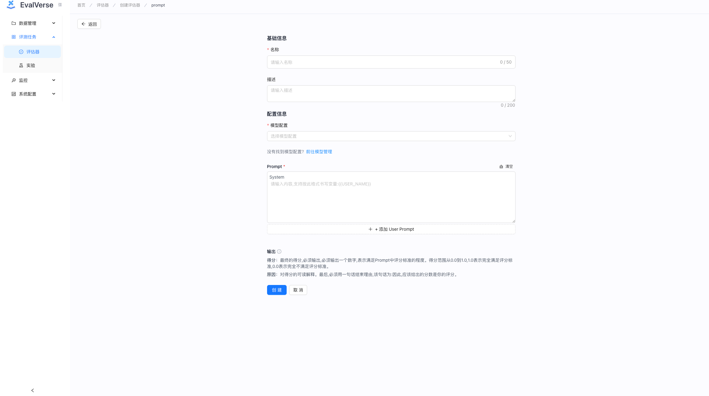

### Managing Evaluator Versions

1. Open the evaluator detail page
2. Go to the **Versions** tab
3. View all versions and their status
4. Create a new version by clicking **Create Version**
5. Compare versions using the diff view

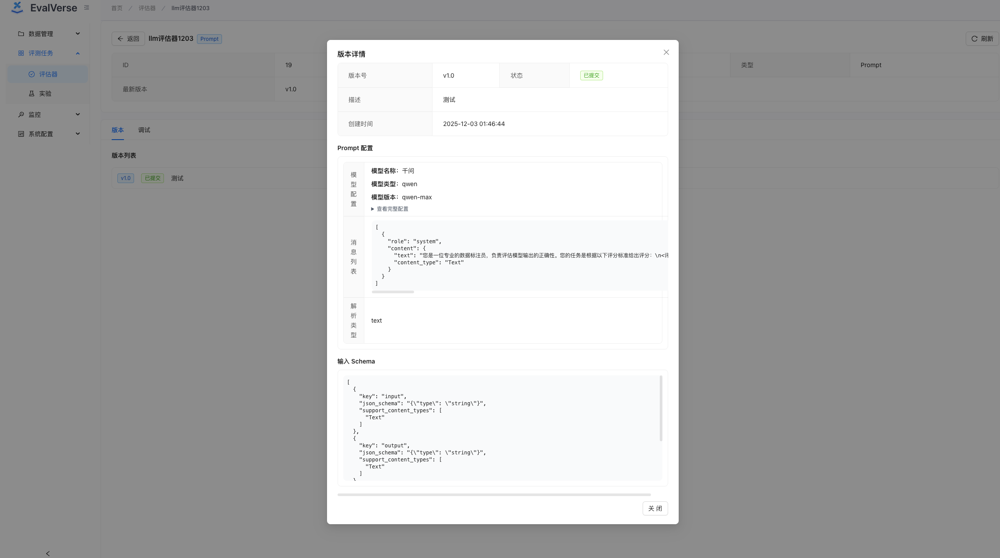

### Testing Evaluators

1. In the evaluator detail page, use the **Debug** panel
2. Enter test input data
3. Click **Run** to test the evaluator
4. View the output and score


---

## Model Configuration

### Adding a Model Configuration

1. Navigate to **Model Configs** from the sidebar
2. Click **Add Model Config**
3. Fill in the configuration:
   - **Config Name**: Unique name for this config
   - **Model Type**: Select model type (OpenAI, Anthropic, etc.)
   - **Model Version**: Enter model version
   - **API Key**: Enter your API key
   - **API Base**: (Optional) Custom API endpoint
   - **Temperature**: Set temperature parameter
   - **Max Tokens**: Set max tokens
   - **Timeout**: Set request timeout
4. Click **Save**

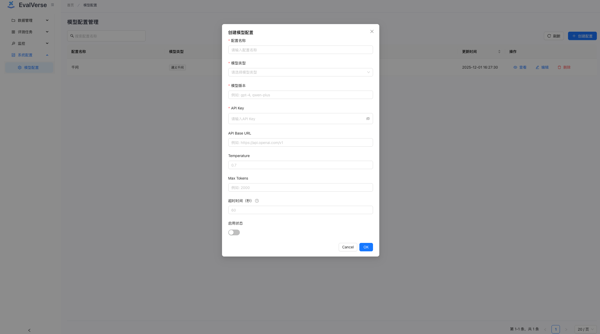

---

## Model Set Management

### Creating a Model Set

1. Navigate to **Model Sets** from the sidebar
2. Click **Create Model Set**
3. Select the model set type:
   - **Agent API**: For agent-based APIs
   - **LLM Model**: For LLM models
4. Configure the model set:
   - **Name**: Enter model set name
   - **Description**: Add description
   - **Config**: Configure model parameters
5. Click **Save**

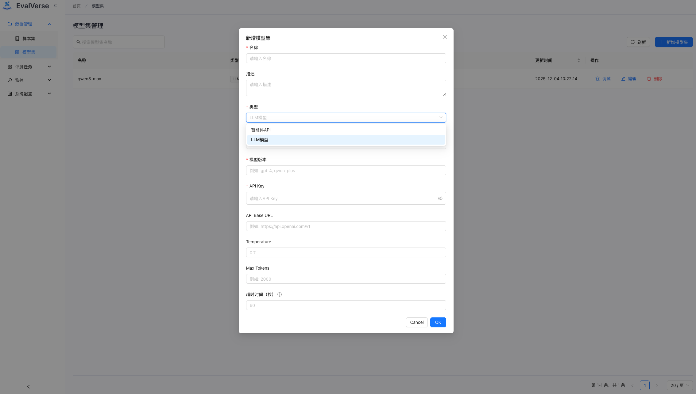

---

## Experiment Management

### Creating an Experiment

1. Navigate to **Experiments** from the sidebar
2. Click **Create Experiment**
3. Follow the step-by-step wizard:

   **Step 1: Basic Information**
   - Enter experiment name and description

   **Step 2: Configure Dataset**
   - Select a dataset
   - Choose a dataset version

   **Step 3: Configure Evaluation Target** (Optional)
   - Select evaluation target type (Prompt, API, or None)
   - Configure target settings

   **Step 4: Configure Evaluators**
   - Select one or more evaluators
   - Choose evaluator versions

   **Step 5: Advanced Settings**
   - Set concurrency number
   - Configure timeout settings
   - Set experiment type (Offline/Online)

   **Step 6: Review and Confirm**
   - Review all settings
   - Click **Create** to start the experiment

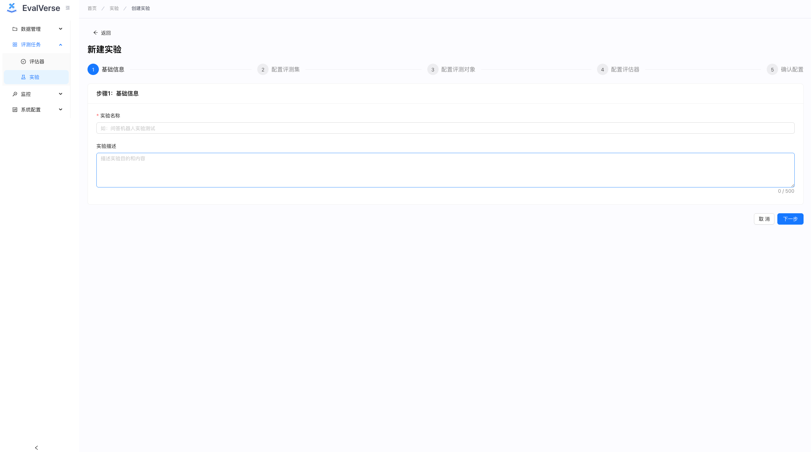

### Running an Experiment

1. After creating an experiment, it will start automatically
2. View the experiment detail page to see:
   - Real-time progress
   - Current status
   - Running statistics
3. Wait for the experiment to complete

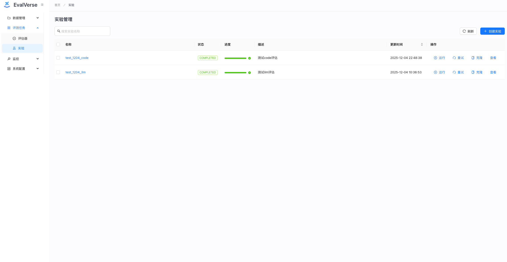

### Viewing Experiment Results

1. Open the experiment detail page
2. Go to the **Results** tab
3. View detailed results:
   - Individual item scores
   - Evaluation reasons
   - Actual outputs
   - Error messages (if any)
4. Use filters to search and filter results

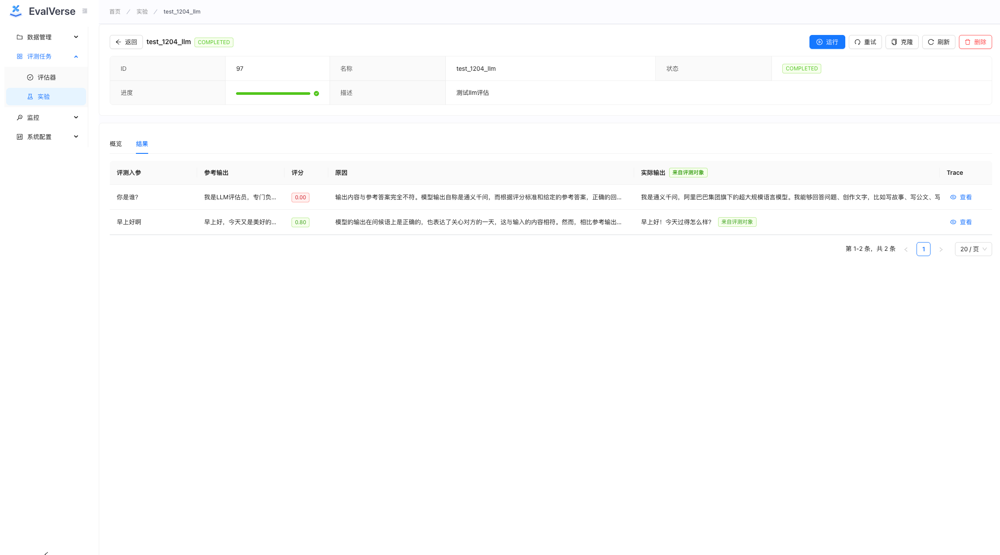

### Viewing Statistics

1. In the experiment detail page, go to the **Statistics** tab
2. View aggregated statistics:
   - Average scores
   - Score distribution
   - Success/failure rates
   - Evaluator performance comparison

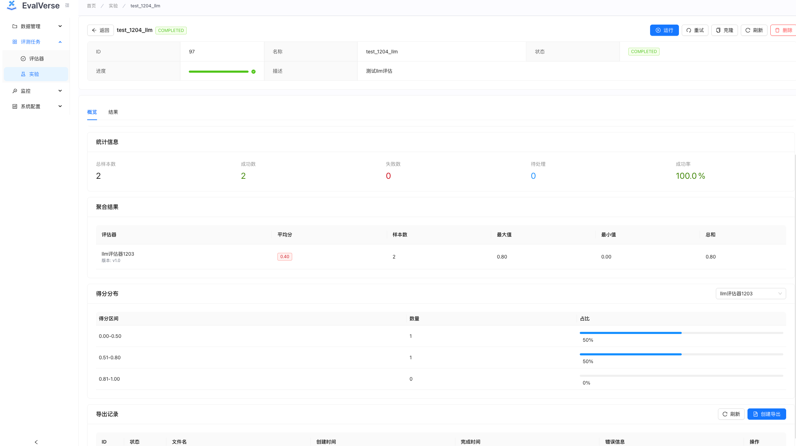


---

## Tips and Best Practices

### Dataset Management
- Use meaningful dataset names and descriptions
- Create versions before making major changes
- Validate data before importing large files
- Use schemas to ensure data consistency

### Evaluator Development
- Test evaluators thoroughly before using in experiments
- Use version control to track evaluator changes
- Document your evaluation logic clearly
- Handle edge cases and errors gracefully

### Experiment Configuration
- Start with small datasets for testing
- Adjust concurrency based on your system resources
- Monitor experiment progress regularly
- Review results carefully before making decisions

### Performance Optimization
- Use appropriate timeout settings
- Monitor system resources during experiments
- Use model sets for batch evaluation
- Export and archive old experiment results

---

## Troubleshooting

### Common Issues

**Dataset Import Fails**
- Check file format and encoding
- Verify field mappings
- Check file size limits

**Evaluator Execution Errors**
- Review evaluator code for syntax errors
- Check input/output schema compatibility
- Verify model configuration

**Experiment Stuck**
- Check Celery worker status
- Verify Redis connection
- Review experiment logs

**Slow Performance**
- Reduce concurrency settings
- Check database performance
- Monitor system resources

---

For more information, please refer to the [README](../README.md) or submit an issue on [GitHub](https://github.com/super6865/EvalVrese/issues).

